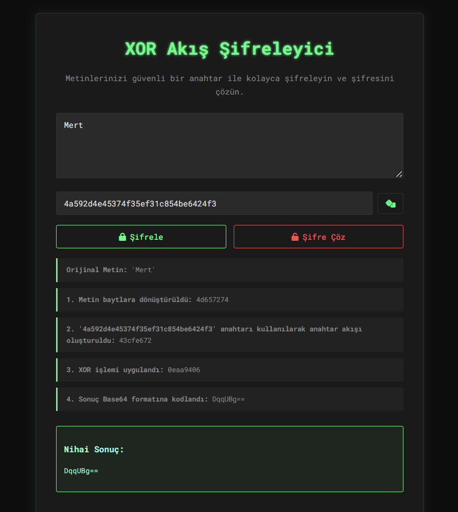
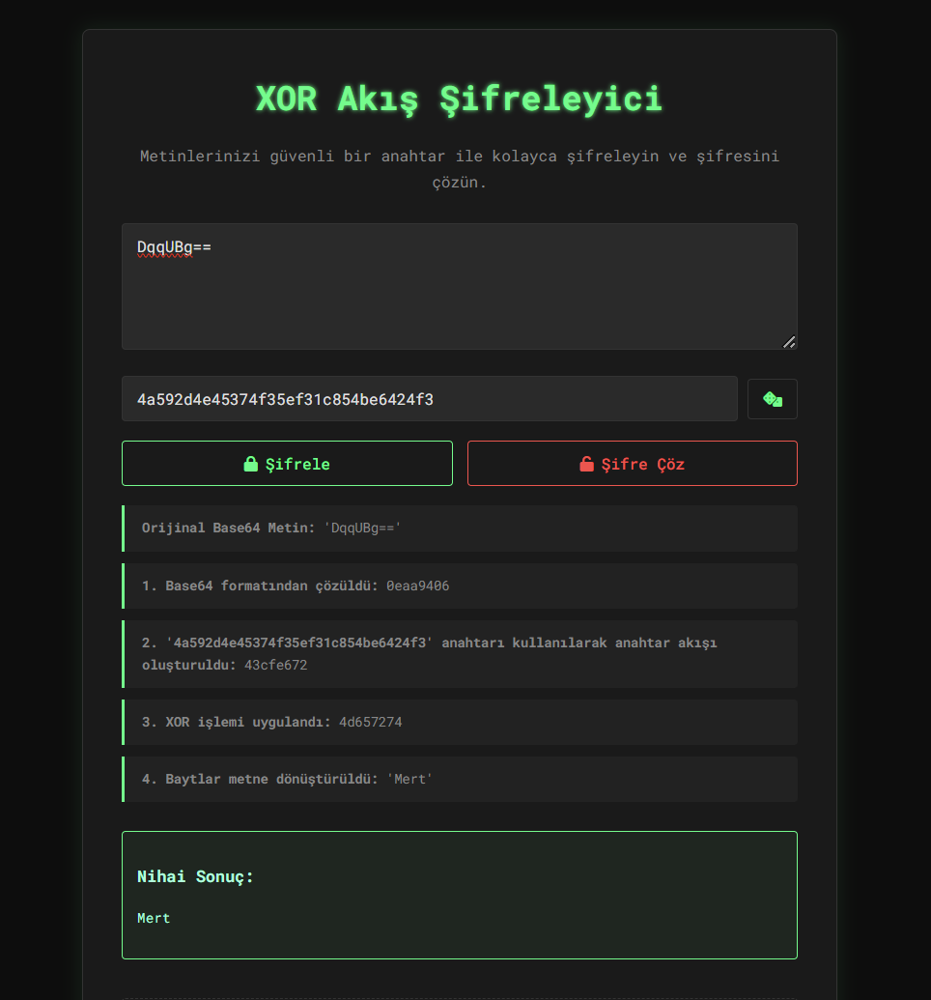

# XOR Akış Şifreleyici

[](https://www.python.org/) [](https://flask.palletsprojects.com/)

Metinleri **XOR akış şifreleme (XOR stream cipher)** yöntemiyle şifrelemek ve çözmek için geliştirilmiş, modern ve "Matrix" temalı bir web uygulamasıdır. Kullanıcı dostu arayüzü, şifreleme sürecinin adımlarını şeffaf bir şekilde göstererek öğrenmeyi kolaylaştırır.





## ✨ Özellikler

- **Modern Arayüz:** Siberpunk ve "Matrix" estetiğinden ilham alan, şık ve kullanışlı bir tasarım.
- **Metin Tabanlı Anahtar:** Sayısal "seed" yerine, hatırlanması kolay herhangi bir metni (parola, cümle vb.) anahtar olarak kullanabilme.
- **Güvenli Anahtar Üretimi:** Tek tıkla kriptografik olarak güvenli ve rastgele anahtarlar oluşturma butonu.
- **Adım Adım Süreç Gösterimi:** Şifreleme ve şifre çözme işlemlerinin (metnin byte'a çevrilmesi, anahtar akışının oluşturulması, XOR işlemi vb.) her adımını görsel olarak takip etme imkanı.
- **Saf Python & Flask:** Hafif ve anlaşılır bir teknoloji yığını ile geliştirilmiştir.

## 🛠️ Projenin Mantığı

XOR akış şifreleme, bir açık metnin her bir baytını, sözde rastgele oluşturulmuş bir anahtar akışının ilgili baytı ile birleştiren simetrik bir şifreleme yöntemidir. "Simetrik" olması, aynı anahtarın hem şifreleme hem de şifre çözme için kullanıldığı anlamına gelir.

Uygulama şu adımları izler:

1.  **Anahtar (Seed) İşleme:** Kullanıcının girdiği metin tabanlı **"anahtar" (seed)**, `SHA-256` algoritması ile özetlenir (hash'lenir). Bu, metin anahtardan deterministik (her zaman aynı sonucu veren) ve güvenli bir sayısal başlangıç noktası oluşturur.
    > **Neden SHA-256?** Farklı uzunluktaki metin anahtarlardan sabit uzunlukta, tahmin edilmesi zor ve güvenli bir başlangıç noktası elde etmemizi sağlar.

2.  **Anahtar Akışı Üretimi:** Bu sayısal başlangıç noktası, bir sözde rastgele sayı üretecini başlatır. Bu üreteç, şifrelenecek metinle birebir aynı uzunlukta olan ve **"anahtar akışı"** olarak adlandırılan bir bayt dizisi oluşturur.

3.  **Byte'a Dönüştürme:** Şifrelenecek metin, evrensel bir standart olan `UTF-8` kullanılarak bir bayt dizisine dönüştürülür.

4.  **XOR İşlemi:** Metnin her bir baytı, anahtar akışındaki karşılık gelen bayt ile **XOR (özel veya)** mantıksal işlemine tabi tutulur.
    > XOR'un sihri, işlemin kendi tersi olmasıdır: `(Metin XOR Anahtar) XOR Anahtar = Metin`. Bu sayede, şifreli metne aynı anahtarla tekrar XOR uygulandığında orijinal metin geri elde edilir.

5.  **Base64 Kodlama:** XOR işlemi sonucunda oluşan şifreli ikili veri, herhangi bir metin ortamında (e-posta, web sayfası vb.) güvenle saklanabilen ve taşınabilen bir metin formatı olan **Base64**'e dönüştürülür.

## 🚀 Kurulum ve Çalıştırma

Bu projeyi kendi bilgisayarınızda çalıştırmak için aşağıdaki adımları izleyin.

### Gereksinimler

- [Python 3.7+](https://www.python.org/downloads/)
- `pip` (Python paket yöneticisi)

### Adımlar

1.  **Projeyi Klonlayın:**
    ```bash
    git clone https://github.com/mertucan/XOR-Stream-Cipher.git
    cd XOR-Stream-Cipher
    ```

2.  **Sanal Ortam Oluşturun (Önerilir):**
    ```bash
    # Windows
    python -m venv venv
    
    # macOS / Linux
    python3 -m venv venv
    ```

3.  **Sanal Ortamı Aktif Edin:**
    - **Windows (PowerShell):**
      ```powershell
      .\venv\Scripts\Activate.ps1
      ```
    - **macOS / Linux:**
      ```bash
      source venv/bin/activate
      ```

4.  **Gerekli Kütüphaneleri Yükleyin:**
    ```bash
    pip install -r requirements.txt
    ```

5.  **Web Sunucusunu Başlatın:**
    ```bash
    python app.py
    ```

6.  **Uygulamayı Açın:**
    Terminalde `* Running on http://127.0.0.1:5000` gibi bir çıktı göreceksiniz. Bu adresi kopyalayıp web tarayıcınıza yapıştırarak uygulamayı açabilirsiniz.

Artık uygulamayı kullanmaya hazırsınız!
